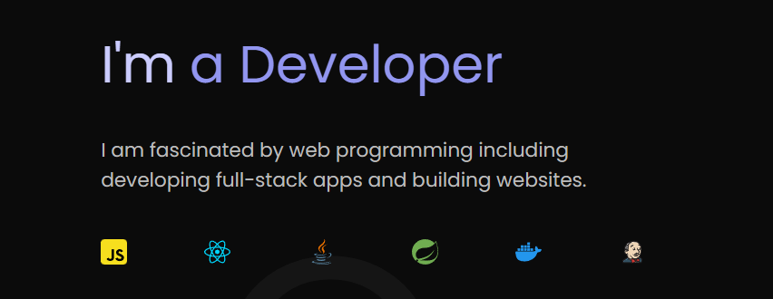

### Hi there 👋, I am Kantimahanty Rohit
#### I am a Full Stack Developer

I am pursuing my M. Tech in computer science from IIIT Bangalore.
Open to explore new areas and emerging technologies with strong understanding of core subjects like OS, computer networks and DBMS.
I am fascinated by web programming e.g. developing apps and building websites. 

I am into sports like basketball and I like to go to gym. But that doesn't mean I don't like singing, it's my hobby :-)

Languages: C++ / Java / Python

Skills: React JS / React Native / Spring boot / Javascript / Jenkins / Docker

- 🔭 I’m currently working on Optimization of Microservice Pods 
- 💬 Ask me about Full Stack Development and DevOps 
- 📫 How to reach me: rohit.apex1999@gmail.com 
- ⚡ Fun fact: I can give a talk on ANIME 

      

  

